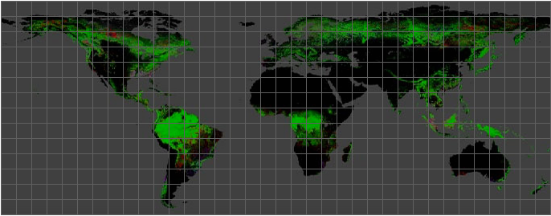
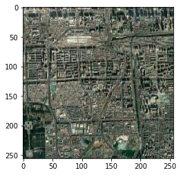
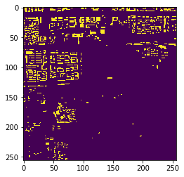

 





****

# DARTH
**The Satellite Imagery DataSet Toolkit**


## Install


```bash
pip install darth
```

#### Addition Huawei OBS Server Package (Optional)

```bash
cd obs-src
python setup.py install
```
#### Requirement:
```bash
pip install -f requirement.txt
```

## Useage:
|[Guide to Start](document/GuidetoStart.md)|[Document](document/doc.md)|
|:---:|:---:|


The Satellite Imagery DataSet is important part to train, validation the model of different mission. 
This toolkit work for download different datasources and use specific layer (class) in [OSM Vector Data](https://openmaptiles.com/downloads/planet/) to generate dataset for train or validation model.

### Support Vector Datasource type:

* MBTiles
* Shapefile
* Pbf
* Geojson


First of all , the layer name & class should be know as prior knowledge that mean the same class maybe has different keyword in OSM data and definition. like 'water' as a classname, but same classname in OSM data will be 'waterway','water','lake'...
### Support Raster Dataset key:

   * Google
   * Google China,
   * Google Maps,
   * Google Satellite,
   * Google Terrain,
   * Google Terrain Hybrid,
   * Google Satellite Hybrid
   * Stamen Terrain
   * Stamen Toner
   * Stamen Toner Light
   * Stamen Watercolor
   * Wikimedia Map
   * Wikimedia Hike Bike Map
   * Esri Boundaries Places
   * Esri Gray (dark)
   * Esri Gray (light)
   * Esri National Geographic
   * Esri Ocean,
   * Esri Satellite,
   * Esri Standard,
   * Esri Terrain,
   * Esri Transportation,
   * Esri Topo World,
   * OpenStreetMap Standard,
   * OpenStreetMap H.O.T.,
   * OpenStreetMap Monochrome,
   * OpenTopoMap,
   * Strava All,
   * Strava Run,
   * Open Weather Map Temperature,
   * Open Weather Map Clouds,
   * Open Weather Map Wind Speed,
   * CartoDb Dark Matter,
   * CartoDb Positron,
   * Bing VirtualEarth
   
### Usage:
#### Step 1:
Download the tile file is the first step. But the almost data resources supporter didn't write the projection information to tile file. So the compute tile projection infomation & write to file is most import part in process of download flow.

**Optional :**
```python
from darth.downloader import downloader
Google=downloader("Google Satellite",thread_count=8)
```
Ues the 8 thread(if you have more thread could set more) to process download that will speed up whole flow of step1.
****


```python
from darth.downloader import downloader
Google=downloader("Google Satellite")
```

    # ---------------------------------------------------------------------------- #
    #                            MAP Production Toolkit                            #
    # ---------------------------------------------------------------------------- #
    # ---------------------- MAP Serverv Init Successful by ---------------------- #
    # ---------------------- Google Satellite ------------------------------------ #


****
### Demo:
We could choose a position like the Saltlake city, Utah states.

Salt Lake City is located in United States country, in North America continent (or region). DMS latitude longitude coordinates for Salt Lake City are: 40°45'38.81"N, 111°53'27.78"W.
• Latitude position: Equator ⇐ 4532km (2816mi) ⇐ Salt Lake City ⇒ 5475km (3402mi) ⇒ North pole.
• Longitude position: Salt Lake City ⇐ 8644km (5371mi) ⇐ Prime meridian. GMT: -6h.
• Local time in Salt Lake City: Friday 1:35 am, May 22, 2020. [*time info]

We need plan a area that describe by WGS84 lonlat,like:

* Cord1=(-111.89105,40.76078) # Left Top Lonlat

* Cord2=(-111.8,40.7)# Right Bottom Lonlat

In addition, we need set the `zoom level` that mean resolution of each map tile. Relative info:


The data will generate as tiles (256*256 image), you also could use `DOWNLOADER_INSTANCE`.merge() to merge all the tiles to whole tiff file.

addcord() as a function ,input is WGS cord of left-top point & right-bottom point x1,y1,x2,y2,additional zoom level that mean different level density of data grid.

    left, top : left-top coordinate, for example (100.361,38.866)

    right, bottom : right-bottom coordinate

    z : zoom
    filePath : File path for storing results, TIFF format


```python
Google.add_cord(116.3, 39.9, 116.6, 39.7, 13)# WGS Lonlat Form
Google.download()
#Google.merge()#Merge to one tif file 
```


    # -----WGS BoundingBox: (116.27325422704708, 39.90850398784923, 116.62506415757257, 39.67233079805734)
    # -----Mercator BoudingBox: (12943479.451629978, 4852655.222148937, 12982642.753946641, 4818439.909406773)
    # -----Total tiles number：8 X 7


      0%|          | 0/56 [00:00<?, ?it/s]

    # -----Url Queue size: 56


     88%|████████▊ | 49/56 [00:00<00:00, 30.20it/s]
    100%|██████████| 56/56 [00:00<00:00, 93877.31it/s]
    100%|██████████| 56/56 [00:00<00:00, 57.96it/s]

    # ===== Decode Downloading...
    # ------------------------------- Download Done ------------------------------ #
    
    # ===== Save description done Google China-Sun Jun 28 10:51:01 2020-(116.3, 39.9, 116.6, 39.7)-13.json


****
The new version of data toolkit will have dict to save info during process.
format:
```json
tileinfo={
    "time":str(time.asctime(time.localtime(time.time()))),
    "left":self.left,
    "top":self.top,
    "right":self.right,
    "bottom":self.bottom,
    "zoom":self.zoom,
    "server":self.server,
    "data":self.result
    }
```
The each downloaded item will has a self description key like:
```json
{
    'server': 'Google Satellite', 
    'info': [6743, 3104, 13], 
    'url': 'https://mt1.google.com/vt/lyrs=s&x=6743&y=3104&z=13', 
    'path': './images/Google Satellite-6743-3104-13.tif'
}

```


****


```python
tiles=[i["path"] for i in Google.result]
```

****
The Vector & Raster Class could do some I/O, transform object to raster or vector object.

For instance, we use a shapefile that downloads from https://gis.utah.gov/ as the label to generate ground-truth.

If the timestamp of two data sources (vector & raster) is almost the same, you could get a high-quality dataset. 

Additionally, https://www.openstreetmap.org/ has global vector product as below: 
****


```python
from darth.vector import Vector
Building=Vector('/home/winshare/Downloads/2017-07-03_asia_china.mbtiles')# 3.7GB SQLiteBased-MBTiles . The China Main Class Vector Object.
```


    # ---------------------------------------------------------------------------- #
    #                                Vector Toolkit                                #
    # ---------------------------------------------------------------------------- #
    # ---------------------------------------------------------------------------- #
    #                            TIFF process Toolkit                              #
    # ---------------------------------------------------------------------------- #
    # -----Class TIF init without filename
    # -----Valid vector format : mbtiles
    
    # ----------------------------- Meta Information ----------------------------- #
    # -----ZOOM_LEVEL : 14                                                         #
    # -----attribution : <a href="http://www.openmaptiles.org/" target="_blank">&co#
    # -----center : 116.4025,39.92,14                                              #
    # -----description : Extract from https://openmaptiles.org                     #
    # -----maxzoom : 14                                                            #
    # -----minzoom : 0                                                             #
    # -----name : OpenMapTiles                                                     #
    # -----pixel_scale : 256                                                       #
    # -----mtime : 1499626373833                                                   #
    # -----format : pbf                                                            #
    # -----id : openmaptiles                                                       #
    # -----version : 3.6.1                                                         #
    # -----maskLevel : 5                                                           #
    # -----bounds : 115.686,39.414,117.119,40.426                                  #
    # -----planettime : 1499040000000                                              #
    # -----basename : china_beijing.mbtiles                                        #
    # ----------------------------- Meta Information ----------------------------- #
    
    # -----Description :  /workspace/osm-2017-07-03-v3.6.1-china_beijing.mbtiles
    # -----LayerCount: 15
    # -----Layer : 0  LayerName :  water 
    # -----Layer : 1  LayerName :  waterway 
    # -----Layer : 2  LayerName :  landcover 
    # -----Layer : 3  LayerName :  landuse 
    # -----Layer : 4  LayerName :  mountain_peak 
    # -----Layer : 5  LayerName :  park 
    # -----Layer : 6  LayerName :  boundary 
    # -----Layer : 7  LayerName :  aeroway 
    # -----Layer : 8  LayerName :  transportation 
    # -----Layer : 9  LayerName :  building 
    # -----Layer : 10  LayerName :  water_name 
    
****
The most of SQLite based mbtiles vector database will have multi-layer, but wkt based shapefile & geojson almost have single layer.
Normally , Name of layer is class name that must set as default layer by `getDefaultLayerbyName` function. So we need choose a default layer by 'LayerName' that will generate binary label for deep learning training.

* Of course , the function of multi-layer will update in next version.
****


```python
Building.getDefaultLayerbyName("building")
```

    ----- Set Default Layer  building  :  <osgeo.ogr.Layer; proxy of <Swig Object of type 'OGRLayerShadow *' at 0x7fd4b2566660> >
    <osgeo.ogr.Layer; proxy of <Swig Object of type 'OGRLayerShadow *' at 0x7fd4b2566660> >


****
### Step 2:

If the data use for model training, we should have label that could be generate by rasterize vector file. Normally, the data will label by artificial work.But human resources has limit in huge object label with high resolution imagery. The OSM Vector data has a worldwide version that save in sqlite based mbtiles file system that could be decode by GDAL library.

The Class Vector and Raster is important part of data I/O. Rasterisation (or rasterization) is the task of taking an image described in a vector graphics format (shapes) and converting it into a raster image (a series of pixels, dots or lines, which, when displayed together, create the image which was represented via shapes).[1][2] The rasterised image may then be displayed on a computer display, video display or printer, or stored in a bitmap file format. Rasterisation may refer to the technique of drawing 3D models, or the conversion of 2D rendering primitives such as polygons, line segments into a rasterized format.

The map data has better relative accuracy than temporary human label work that mean the vector map has potential to be ground-truth. So, transform the exist vector to raster data that is indispensable method for generate training data in deeplearning-based computer vision mission.

Rasterize:


****

#### Notes:

If the vector layers have a huge geography space and enormous amount of data item that will cause the indexing process will extremely inefficient in rasterize process. 

We set a rect size like a bounding box of Beijing city from the geographic area of CHINA. Then, we set the same area as filters in the whole space.

That could show the speed of the same mission on with filter and without a filter.

|Experiment|||
|:---:|:---:|:---:|
|               |item/Sec|       100000sample|
|withoutFilter|        34|           94  hour|
| withFilter|           3|           8.3 hour|

Although i am already boost the rasterize flow , but that still run on single process ,i still want to find a way that run GDAL rasterize on python multiprocessing.


```python
Building.crop_default_layer_by_rect(Google.mercator_cord)#FILTER to speed up
label=Building.generate(tiles)
```

      0%|          | 0/56 [00:00<?, ?it/s]

    -----Set filter Rect: (12944152.11792486, 4852834.051769256, 12983287.876406869, 4818590.263097501)
    -----Start Generate.....


    100%|██████████| 56/56 [00:18<00:00,  2.99it/s]


If we write the 'image' & 'label' to csv / json that could be great dataset for deeplearning training work flow.

And we have finished that on the [Process](document/GuidetoStart.md) workflow.
We could show the label&image like that. 


```python
import tifffile as tif 
import matplotlib.pyplot as plt
image=tif.imread(tiles[1])
label=tif.imread(label[1])
plt.imshow(image),plt.show()
plt.imshow(label),plt.show()
```








****


Neural network , let's fuck!


Copyright 2020 winshare
 
 Licensed under the Apache License, Version 2.0 (the "License");
 you may not use this file except in compliance with the License.
 You may obtain a copy of the License at
 
     http://www.apache.org/licenses/LICENSE-2.0
 
 Unless required by applicable law or agreed to in writing, software
 distributed under the License is distributed on an "AS IS" BASIS,
 WITHOUT WARRANTIES OR CONDITIONS OF ANY KIND, either express or implied.
 See the License for the specific language governing permissions and
 limitations under the License.
