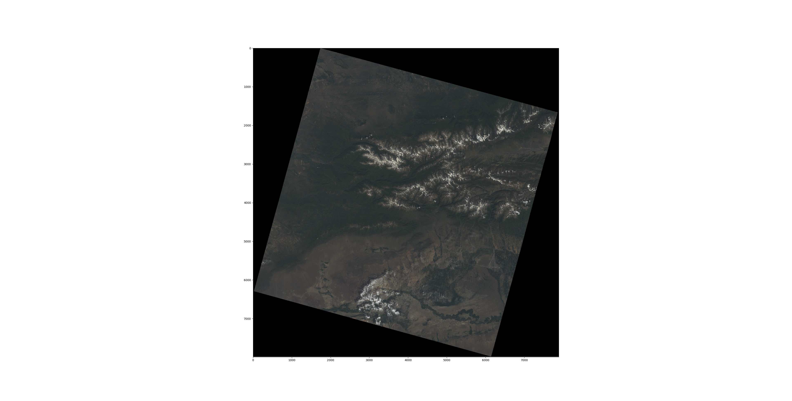
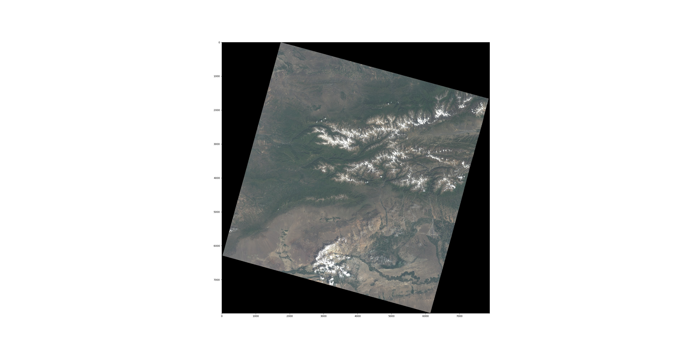

<!--
 Copyright 2020 tq
 
 Licensed under the Apache License, Version 2.0 (the "License");
 you may not use this file except in compliance with the License.
 You may obtain a copy of the License at
 
     http://www.apache.org/licenses/LICENSE-2.0
 
 Unless required by applicable law or agreed to in writing, software
 distributed under the License is distributed on an "AS IS" BASIS,
 WITHOUT WARRANTIES OR CONDITIONS OF ANY KIND, either express or implied.
 See the License for the specific language governing permissions and
 limitations under the License.
-->

# Document 

- [Document](#document)
  - [`Raster`](#raster)
    - [`readtif(tif_file_path)`](#readtiftif_file_path)
    - [`fast_percentager_strentching(image=None, percentage=2, sample=10000)`](#fast_percentager_strentchingimagenone-percentage2-sample10000)
    - [`writeimagery(name=None, format="png")`](#writeimagerynamenone-formatpng)
    - [`resize_raster(resize_ratio=0.5)`](#resize_rasterresize_ratio05)
    - [`writethreshold2shp()`](#writethreshold2shp)
    - [Cord Transform](#cord-transform)
      - [`imagexy2geo`](#imagexy2geo)
      - [`lonlat2geo`](#lonlat2geo)
      - [`geo2lonlat`](#geo2lonlat)
      - [`getSRSPair`](#getsrspair)
      - [`geo2imagexy`](#geo2imagexy)
      - [`lonlat2imagexy`](#lonlat2imagexy)
      - [`imagexy2lonlat`](#imagexy2lonlat)
    - [`clear()`](#clear)
  - [`Vector`](#vector)
    - [`readshp(input_shp_path)`](#readshpinput_shp_path)
    - [`getDefaultLayerbyName(name)`](#getdefaultlayerbynamename)
    - [getbounding](#getbounding)
    - [SaveVectorByLayerName](#savevectorbylayername)
    - [Rasterize](#rasterize)
    - [generate](#generate)
    - [reset_layer](#reset_layer)
  - [`downloader`](#downloader)
    - [add_cord](#add_cord)
    - [download](#download)
    - [merge](#merge)
  - [process](#process)
  - [OBS(Optional)](#obsoptional)
    - [bucket](#bucket)
      - [getBucketMetadata](#getbucketmetadata)
      - [upload](#upload)
      - [download](#download-1)
      - [cd](#cd)
      - [delete](#delete)
      - [ls](#ls)
    - [QGIS Map Resources Script:](#qgis-map-resources-script)


## `Raster`
Tagged Image File Format, abbreviated TIFF or TIF, is a computer file format for storing raster graphics images, popular among graphic artists, the publishing industry,[1] and photographers. TIFF is widely supported by scanning, faxing, word processing, optical character recognition, image manipulation, desktop publishing, and page-layout applications.[2] The format was created by Aldus Corporation for use in desktop publishing. It published the latest version 6.0 in 1992, subsequently updated with an Adobe Systems copyright after the latter acquired Aldus in 1994.

The GDAL lib could decode tif file with full geography information. 

python
```python
from darth.raster import Raster
r=Raster() # init  without file
r1=Raster("input.tif") #  init with file
```

### `readtif(tif_file_path)`

also could read file in anywhere:

```python
r.readtif("input.tif")
```


### `fast_percentager_strentching(image=None, percentage=2, sample=10000)`

the huge imagery percentage strentching is a slow process , this project re-design the strentching algorithm to boost the process to o(1).

eg - input


eg - output (original percentage strentching algorithm (30s) )


eg - ouput (fast percentage strentching algorithm (1s))




```python
Imagery=r.fast_percentager_strentching()
``` 
if the image is none , default image is result of Class.image

### `writeimagery(name=None, format="png")`


write a pure image file like png 
```python
r.writeimagery('image')
```


### `resize_raster(resize_ratio=0.5)`

Some raster has wrong size or GDAL datasets.This function will keep the geography information & resize image . 

### `writethreshold2shp()`

vectorize binary ndarray . you must set binary uint8 ndarray data first. That will generate shapefile of vectorized binary information.
```python
Data=np.ones((512,512),dtype=np.uint8)
r.setdata(Data)
r.writethreshold2shp()
```

### Cord Transform
#### `imagexy2geo`
#### `lonlat2geo`
#### `geo2lonlat`
#### `getSRSPair`
#### `geo2imagexy`
#### `lonlat2imagexy`
#### `imagexy2lonlat`
All the transform function could work that base on you already read a tiff file that has decoded to gdal dataset successful.
like :
```
cord=r.imagexy2geo(0,0)

``` 
that will transform the image cord to geo cord.

### `clear()`
clear all the class status of IO
```python
r.clear()

```

## `Vector`

this class already support some vector file format:

   * MBTiles 
   * Shapefile
   * Pbf
   * Geojson

```python
from darth.vector import Vector
V=Vector("input_shp_path.shp")# init with shp
v=Vector()# init without shp
```
Additionally, the `Vector` class inherit the `Raster` class , so you could use and call all function with single instance.like:
```python
v.readtif("input.tif")
```


you could use this class to solve some rasterize problems
### `readshp(input_shp_path)`

```python
v.readshp(input_shp_path)

```
### `getDefaultLayerbyName(name)`
Choose layer name as default layer.
eg:
    # -----Description :  /workspace/osm-2017-07-03-v3.6.1-china_beijing.mbtiles
    # -----LayerCount: 15
    # -----Layer : 0  LayerName :  water 
    # -----Layer : 1  LayerName :  waterway 
    # -----Layer : 2  LayerName :  landcover 
    # -----Layer : 3  LayerName :  landuse 
    # -----Layer : 4  LayerName :  mountain_peak 
    # -----Layer : 5  LayerName :  park 
    # -----Layer : 6  LayerName :  boundary 
    # -----Layer : 7  LayerName :  aeroway 
    # -----Layer : 8  LayerName :  transportation 
    # -----Layer : 9  LayerName :  building 
    # -----Layer : 10  LayerName :  water_name 

```python
v.getDefaultLayerbyName("building")
```

### getbounding
get vector file bounding box cord
```python
bounding=v.getbounding()
```

### SaveVectorByLayerName
`SaveVectorByLayerName(LayerName, outputname, format="GeoJSON")`
This function could be save the one layer of multi-layer vector object .
```python
v.SaveVectorByLayerName("building","building.shp"):
```


### Rasterize
`Rasterize(outputname, Nodata=0)`
map the vector layer with raster dataset and generate rasterized vector file.
Tips :
this function just read defaultlayer ,so must set default layer first.


### generate
`generate(tiles,output_path="./label"):`
* tiles       :        list of tif file paths
* output_path :        dir of target output

```python
v.generate(tiles)
```

### reset_layer

reset the default layer & all layer option
```python
v.reset_layer()
```

## `downloader`
`downloader(server=None,thread_count=4,format='tif')`

`downloader` is resources lib & all the source could found here like :

```python
    Google=downloader("Google Satellite")
```

I don't test the limit of download count . But different country may be has totally different problem.
For example ,in china internet enviroment ,'Google Satellite' cloud be nothing response with code 404.
At this time, we use the OSM standard to support datasource list:

    
   * Google
   * Google China,
   * Google Maps,
   * Google Satellite,
   * Google Terrain,
   * Google Terrain Hybrid,
   * Google Satellite Hybrid
   * Stamen Terrain
   * Stamen Toner
   * Stamen Toner Light
   * Stamen Watercolor
   * Wikimedia Map
   * Wikimedia Hike Bike Map
   * Esri Boundaries Places
   * Esri Gray (dark)
   * Esri Gray (light)
   * Esri National Geographic
   * Esri Ocean,
   * Esri Satellite,
   * Esri Standard,
   * Esri Terrain,
   * Esri Transportation,
   * Esri Topo World,
   * OpenStreetMap Standard,
   * OpenStreetMap H.O.T.,
   * OpenStreetMap Monochrome,
   * OpenTopoMap,
   * Strava All,
   * Strava Run,
   * Open Weather Map Temperature,
   * Open Weather Map Clouds,
   * Open Weather Map Wind Speed,
   * CartoDb Dark Matter,
   * CartoDb Positron,
   * Bing VirtualEarth


### add_cord
` add_cord(self, left, top, right, bottom, zoom, style='s'):`

Compute the Extent by `(x1,y1,x2,y2)`-Retangle coordinate A
        
    I: coordinate A->WGS Extent of tile
    
    II: Extent->Tile coordinate 
    
    III: Tile coordinate-> array of x,y coordinates WGS left top point in each tile
        
`addcord()` as a function ,input is WGS cord of left-top point & right-bottom point x1,y1,x2,y2,additional zoom level that mean different level density of data grid.

    left, top : left-top coordinate, for example (100.361,38.866)

    right, bottom : right-bottom coordinate

    z : zoom
    filePath : File path for storing results, TIFF format

```python
    Google.add_cord(116.3, 39.9, 116.6, 39.7, 13)#WGS Form
```


### download
`download(output_path="./images")`
download the file to `output_path`


### merge

Merge the all file to single file or not
```python
Google.merge()
```
## process

`Process(VectorDataSource,WgsCord,Class_key,DataSourcesType='Google China',DataSetName="DataSet",Remote_dataset_root="DataSets/",Thread_count=2,Nodata=0,Merge=False,Keep_local=True,Over_write=True,Upload=False,**args)`

* `vector`       : local path of vector object
* `cord`         : WGS Standard Cord (min-lon,min-lat,max-lon,maxlat,zoom_level)
* `class_key`    : The class you need generate
* `Datasource`   : Map production datasource name
* `Merge`        : Merge the tiles file to whole file or not
* `Keep_local`   : The last step will delete local cache ,this option could choose to save it.
* `upload`       : Use Network Strong Server or not (Just support [Huawei OBS server](https://developer.huaweicloud.com/sdk?OBS) now)
* `thread`       : download thread count

* args:
    for obs server:

        ak : access_key_id,    
        sk : secret_access_key,    
        server : server
        bn :  bucketname


1. Step I:
     * Init Downlaoder,Bucket(Optional),Vector

2. Step II:
     * Init default vector layer
     * Init area , imagery level of mission

3. Step III:

     * Download
     * Merge(Optional)
     * Rasterize

4. Step IV:

     * Upload to Bucket

5. Last Step:
     * If don't save temp dataset ,clean the cache
    


## OBS(Optional) 

### bucket

#### getBucketMetadata

#### upload

#### download

#### cd

#### delete

#### ls

### QGIS Map Resources Script:

```python

"""
This script should be run from the Python consol inside QGIS.
 
It adds online sources to the QGIS Browser.
Each source should contain a list with the folowing items (string type):
[sourcetype, title, authconfig, password, referer, url, username, zmax, zmin]
 
You can add or remove sources from the sources section of the code.
 
Script by Klas Karlsson
Sources from https://qms.nextgis.com/
 
Licence GPL-3
 
Regarding the terms of use for these background maps YOU will need to verify that you
follow the individual EULA that comes with the different services,
Most likely they will restrict how you can use the data.
 
"""
 
 
# Sources
sources = []
sources.append(["connections-xyz","Google Maps","","","","https://mt1.google.com/vt/lyrs=m&x=%7Bx%7D&y=%7By%7D&z=%7Bz%7D","","19","0"])
sources.append(["connections-xyz","Google Satellite", "", "", "", "https://mt1.google.com/vt/lyrs=s&x=%7Bx%7D&y=%7By%7D&z=%7Bz%7D", "", "19", "0"])
sources.append(["connections-xyz","Google Terrain", "", "", "", "https://mt1.google.com/vt/lyrs=t&x=%7Bx%7D&y=%7By%7D&z=%7Bz%7D", "", "19", "0"])
sources.append(["connections-xyz","Google Terrain Hybrid", "", "", "", "https://mt1.google.com/vt/lyrs=p&x=%7Bx%7D&y=%7By%7D&z=%7Bz%7D", "", "19", "0"])
sources.append(["connections-xyz","Google Satellite Hybrid", "", "", "", "https://mt1.google.com/vt/lyrs=y&x=%7Bx%7D&y=%7By%7D&z=%7Bz%7D", "", "19", "0"])
sources.append(["connections-xyz","Stamen Terrain", "", "", "Map tiles by Stamen Design, under CC BY 3.0. Data by OpenStreetMap, under ODbL", "http://tile.stamen.com/terrain/%7Bz%7D/%7Bx%7D/%7By%7D.png", "", "20", "0"])
sources.append(["connections-xyz","Stamen Toner", "", "", "Map tiles by Stamen Design, under CC BY 3.0. Data by OpenStreetMap, under ODbL", "http://tile.stamen.com/toner/%7Bz%7D/%7Bx%7D/%7By%7D.png", "", "20", "0"])
sources.append(["connections-xyz","Stamen Toner Light", "", "", "Map tiles by Stamen Design, under CC BY 3.0. Data by OpenStreetMap, under ODbL", "http://tile.stamen.com/toner-lite/%7Bz%7D/%7Bx%7D/%7By%7D.png", "", "20", "0"])
sources.append(["connections-xyz","Stamen Watercolor", "", "", "Map tiles by Stamen Design, under CC BY 3.0. Data by OpenStreetMap, under ODbL", "http://tile.stamen.com/watercolor/%7Bz%7D/%7Bx%7D/%7By%7D.jpg", "", "18", "0"])
sources.append(["connections-xyz","Wikimedia Map", "", "", "OpenStreetMap contributors, under ODbL", "https://maps.wikimedia.org/osm-intl/%7Bz%7D/%7Bx%7D/%7By%7D.png", "", "20", "1"])
sources.append(["connections-xyz","Wikimedia Hike Bike Map", "", "", "OpenStreetMap contributors, under ODbL", "http://tiles.wmflabs.org/hikebike/%7Bz%7D/%7Bx%7D/%7By%7D.png", "", "17", "1"])
sources.append(["connections-xyz","Esri Boundaries Places", "", "", "", "https://server.arcgisonline.com/ArcGIS/rest/services/Reference/World_Boundaries_and_Places/MapServer/tile/%7Bz%7D/%7By%7D/%7Bx%7D", "", "20", "0"])
sources.append(["connections-xyz","Esri Gray (dark)", "", "", "", "http://services.arcgisonline.com/ArcGIS/rest/services/Canvas/World_Dark_Gray_Base/MapServer/tile/%7Bz%7D/%7By%7D/%7Bx%7D", "", "16", "0"])
sources.append(["connections-xyz","Esri Gray (light)", "", "", "", "http://services.arcgisonline.com/ArcGIS/rest/services/Canvas/World_Light_Gray_Base/MapServer/tile/%7Bz%7D/%7By%7D/%7Bx%7D", "", "16", "0"])
sources.append(["connections-xyz","Esri National Geographic", "", "", "", "http://services.arcgisonline.com/ArcGIS/rest/services/NatGeo_World_Map/MapServer/tile/%7Bz%7D/%7By%7D/%7Bx%7D", "", "12", "0"])
sources.append(["connections-xyz","Esri Ocean", "", "", "", "https://services.arcgisonline.com/ArcGIS/rest/services/Ocean/World_Ocean_Base/MapServer/tile/%7Bz%7D/%7By%7D/%7Bx%7D", "", "10", "0"])
sources.append(["connections-xyz","Esri Satellite", "", "", "", "https://server.arcgisonline.com/ArcGIS/rest/services/World_Imagery/MapServer/tile/%7Bz%7D/%7By%7D/%7Bx%7D", "", "17", "0"])
sources.append(["connections-xyz","Esri Standard", "", "", "", "https://server.arcgisonline.com/ArcGIS/rest/services/World_Street_Map/MapServer/tile/%7Bz%7D/%7By%7D/%7Bx%7D", "", "17", "0"])
sources.append(["connections-xyz","Esri Terrain", "", "", "", "https://server.arcgisonline.com/ArcGIS/rest/services/World_Terrain_Base/MapServer/tile/%7Bz%7D/%7By%7D/%7Bx%7D", "", "13", "0"])
sources.append(["connections-xyz","Esri Transportation", "", "", "", "https://server.arcgisonline.com/ArcGIS/rest/services/Reference/World_Transportation/MapServer/tile/%7Bz%7D/%7By%7D/%7Bx%7D", "", "20", "0"])
sources.append(["connections-xyz","Esri Topo World", "", "", "", "http://services.arcgisonline.com/ArcGIS/rest/services/World_Topo_Map/MapServer/tile/%7Bz%7D/%7By%7D/%7Bx%7D", "", "20", "0"])
sources.append(["connections-xyz","OpenStreetMap Standard", "", "", "OpenStreetMap contributors, CC-BY-SA", "http://tile.openstreetmap.org/%7Bz%7D/%7Bx%7D/%7By%7D.png", "", "19", "0"])
sources.append(["connections-xyz","OpenStreetMap H.O.T.", "", "", "OpenStreetMap contributors, CC-BY-SA", "http://tile.openstreetmap.fr/hot/%7Bz%7D/%7Bx%7D/%7By%7D.png", "", "19", "0"])
sources.append(["connections-xyz","OpenStreetMap Monochrome", "", "", "OpenStreetMap contributors, CC-BY-SA", "http://tiles.wmflabs.org/bw-mapnik/%7Bz%7D/%7Bx%7D/%7By%7D.png", "", "19", "0"])
sources.append(["connections-xyz","OpenTopoMap", "", "", "Kartendaten: © OpenStreetMap-Mitwirkende, SRTM | Kartendarstellung: © OpenTopoMap (CC-BY-SA)", "https://tile.opentopomap.org/%7Bz%7D/%7Bx%7D/%7By%7D.png", "", "17", "1"])
sources.append(["connections-xyz","Strava All", "", "", "OpenStreetMap contributors, CC-BY-SA", "https://heatmap-external-b.strava.com/tiles/all/bluered/%7Bz%7D/%7Bx%7D/%7By%7D.png", "", "15", "0"])
sources.append(["connections-xyz","Strava Run", "", "", "OpenStreetMap contributors, CC-BY-SA", "https://heatmap-external-b.strava.com/tiles/run/bluered/%7Bz%7D/%7Bx%7D/%7By%7D.png?v=19", "", "15", "0"])
sources.append(["connections-xyz","Open Weather Map Temperature", "", "", "Map tiles by OpenWeatherMap, under CC BY-SA 4.0", "http://tile.openweathermap.org/map/temp_new/%7Bz%7D/%7Bx%7D/%7By%7D.png?APPID=1c3e4ef8e25596946ee1f3846b53218a", "", "19", "0"])
sources.append(["connections-xyz","Open Weather Map Clouds", "", "", "Map tiles by OpenWeatherMap, under CC BY-SA 4.0", "http://tile.openweathermap.org/map/clouds_new/%7Bz%7D/%7Bx%7D/%7By%7D.png?APPID=ef3c5137f6c31db50c4c6f1ce4e7e9dd", "", "19", "0"])
sources.append(["connections-xyz","Open Weather Map Wind Speed", "", "", "Map tiles by OpenWeatherMap, under CC BY-SA 4.0", "http://tile.openweathermap.org/map/wind_new/%7Bz%7D/%7Bx%7D/%7By%7D.png?APPID=f9d0069aa69438d52276ae25c1ee9893", "", "19", "0"])
sources.append(["connections-xyz","CartoDb Dark Matter", "", "", "Map tiles by CartoDB, under CC BY 3.0. Data by OpenStreetMap, under ODbL.", "http://basemaps.cartocdn.com/dark_all/%7Bz%7D/%7Bx%7D/%7By%7D.png", "", "20", "0"])
sources.append(["connections-xyz","CartoDb Positron", "", "", "Map tiles by CartoDB, under CC BY 3.0. Data by OpenStreetMap, under ODbL.", "http://basemaps.cartocdn.com/light_all/%7Bz%7D/%7Bx%7D/%7By%7D.png", "", "20", "0"])
sources.append(["connections-xyz","Bing VirtualEarth", "", "", "", "http://ecn.t3.tiles.virtualearth.net/tiles/a{q}.jpeg?g=1", "", "19", "1"])
 
 
# Add sources to browser
for source in sources:
   connectionType = source[0]
   connectionName = source[1]
   QSettings().setValue("qgis/%s/%s/authcfg" % (connectionType, connectionName), source[2])
   QSettings().setValue("qgis/%s/%s/password" % (connectionType, connectionName), source[3])
   QSettings().setValue("qgis/%s/%s/referer" % (connectionType, connectionName), source[4])
   QSettings().setValue("qgis/%s/%s/url" % (connectionType, connectionName), source[5])
   QSettings().setValue("qgis/%s/%s/username" % (connectionType, connectionName), source[6])
   QSettings().setValue("qgis/%s/%s/zmax" % (connectionType, connectionName), source[7])
   QSettings().setValue("qgis/%s/%s/zmin" % (connectionType, connectionName), source[8])
 
# Update GUI
iface.reloadConnections()


```